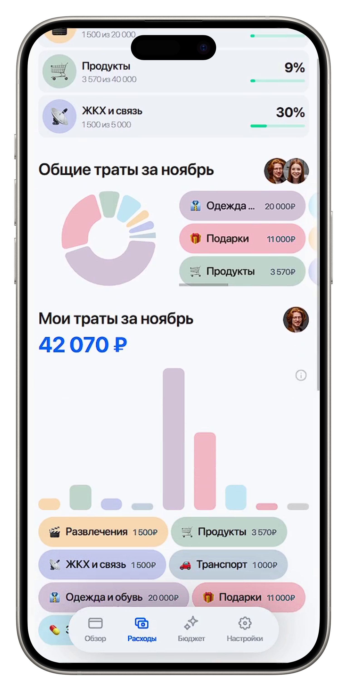

# 🚀 Family Multibank  
**Winner of the special nomination - VTB Hackathon 2025**

Family Multibank is a digital ecosystem for couples who want to manage their finances transparently and efficiently.  
The platform unifies accounts, automates budgeting, visualizes shared financial goals, and helps partners stay financially aligned.

## 📷 Demo

<p align="center">
   
</p>

## 🌟 Key Features

### 🔗 1. Shared Financial Space
- Invite a partner via link or phone number  
- Role-based access control  
- Unified view of all accounts and transactions  

### 💰 2. “Total Balance” Widget
- Combined balance across all accounts  
- Monthly income dynamics  
- Instant answer to: **“How much money do we have?”**  

### 🎯 3. Joint Goals
- Progress bars, deadlines, contribution tracking  
- Emotional goal visualization (travel, home upgrade, savings)  
- Smart goal templates (emergency fund, vacation, renovation)  

### 📊 4. Smart Spending Analytics
- Category-based charts  
- Automatic categorization by MCC codes  
- Drag-and-drop category reassignment  
- Filters by period, owner, category  

### 👥 5. Contribution Comparison (“Partner A / Partner B”)
- Visual comparison of who contributes what  
- No exposure of sensitive transaction details  
- Easier constructive communication about finances  

### 🧺 6. Shared Wallets
- Recurring household expenses (utilities, groceries, subscriptions)  
- Automatic refill rules  
- Full operation history and notifications  

### 📅 7. Payment Calendar
- Statuses: “Paid”, “Upcoming”, “Overdue”  
- Reminders and alerts  
- Monthly obligations forecast  

## 🏗 Tech Stack & Architecture

| Layer | Technologies | Purpose |
|-------|-------------|----------|
| **Frontend** | Next.js 16, React 19, Tailwind CSS 4, @tanstack/react-query | UI, state, data fetching |
| **Backend** | Node.js, Nest.js, Redis, BullMQ | Banking sync, business logic, task queues |
| **Database** | PostgreSQL 15 | Accounts, transactions, goals, users |
| **Infrastructure** | Docker, docker-compose | Orchestration and local development |

## ⚙️ Running the Project

### 🐳 Option 1 — Docker (recommended)

```bash
docker-compose up --build
```

### 💻 Option 2 — Local Setup (without Docker)

#### Backend
```bash
cd backend
npm install
npm run start:dev
```

#### Frontend
```bash
cd frontend
npm install
npm run dev
```
#### Worker
```bash
cd worker
npm install
npm run build
npm run start
```

## 📝 License

This project is distributed under the MIT license.

